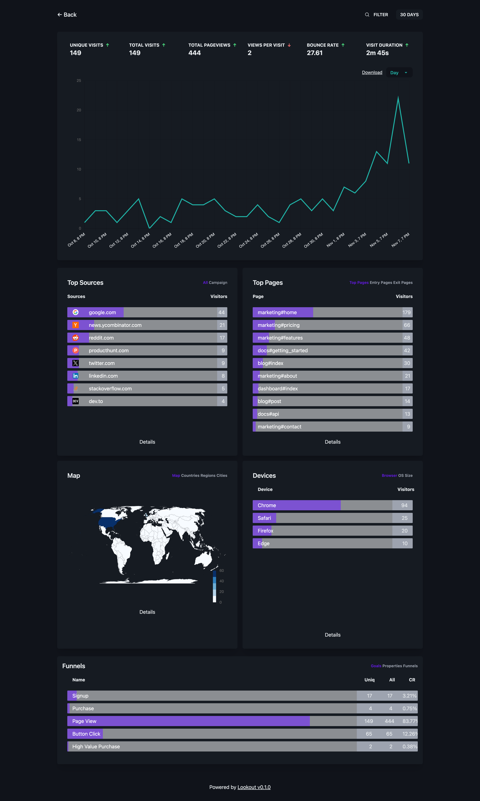

# Lookout

[](https://badge.fury.io/rb/lookout)
[](coverage/index.html)
[](spec/)
[](#rails-compatibility)

A full-featured, mountable analytics dashboard for your Rails app, powered by Ahoy. 

Fork of [Ahoy Captain](https://github.com/joshmn/ahoy_captain) with **SQLite support added** (PG already supported), and **Rails 8 compatibility**.

<a href="https://github.com/RubyOnVibes/lookout/blob/main/ss.png"></a>

## Database Support

Lookout supports **PostgreSQL** and **SQLite**.

## Installation

### 1. Do the bundle

Drop it in:

```bash
$ bundle add lookout-ahoy
```

### 2. Install it

```bash
$ rails g lookout:install
```

### 2.5. Rails 8+ Importmap

In your host app’s `config/importmap.rb`, add a single line to pull in Lookout’s pins:

```ruby
# your app’s pins…
pin "application"
pin "@hotwired/turbo-rails", to: "turbo.min.js"
pin "@hotwired/stimulus", to: "stimulus.min.js"
pin "@hotwired/stimulus-loading", to: "stimulus-loading.js"
pin_all_from "app/javascript/controllers", under: "controllers"

# Lookout Analytics
Lookout.importmap(self)
```

This avoids referencing `Lookout::Engine.root` from your app. For older importmap-rails, Lookout also inlines its own importmap via `lookout_importmap_tags`.

### 3. Make sure your events are setup correctly

Lookout doesn't do any tracking for you; it merely provides a dashboard for your data from the Ahoy gem. 

By default, Lookout assumes you're tracking `controller` and `action` in your `Ahoy::Event` properties, and a page view event is named `$view`. See this section for more information: https://github.com/ankane/ahoy#events

For a quick sanity check:

```ruby
Lookout.event.where(name: Lookout.config.event[:view_name]).count
Lookout.event.with_routes.count
```

This can be fully-customized. See the initializer `config/initializers/lookout.rb` for more.

### 4. Add Migration (Optional)

If you have a large dataset (> 1GB) you probably want some indexes. `rails g lookout:migration`

## Features

* Top sources
* Top pages, landing pages, and exit pages
* UTM reporting
* Top locations, by countries, regions, and cities
* Top devices, by browser, OS, and device type
* Goal tracking
* Funnels
* Filter by:
    * Page
    * Location
    * Device type
    * OS
    * UTM tags
    * Goal
    * Event Property
* CSV exports
* Date comparison

## Contributions

All are welcome to contribute.

## License

The gem is available as open source under the terms of the [MIT License](https://opensource.org/licenses/MIT).

